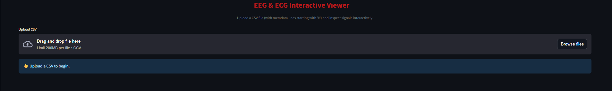
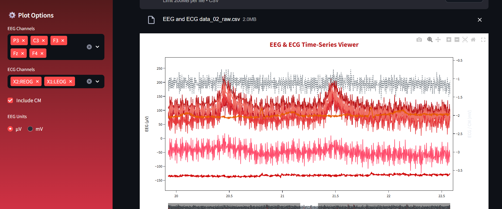
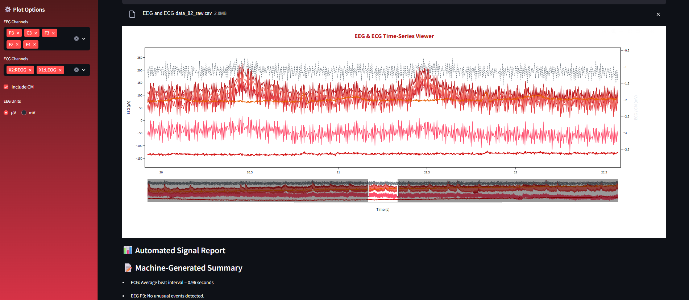

# EEG & ECG Interactive Viewer

A professional web app built with **Streamlit** for visualizing EEG & ECG signals.  
Upload CSV files, explore multi-channel time-series interactively, and generate automated reports that highlight irregular signal behavior.

---

## ✨ Features

- 📂 Upload EEG/ECG CSV files (with metadata lines starting with `#`)
- 📊 Multi-channel plotting (EEG, ECG, CM)
- 🎨 Professional hospital-like UI (clean white, red, pink gradients)
- 🔎 Interactive zooming, scrolling, and range selection
- ⚙️ Custom plot options (channel selection, units, CM inclusion)
- 📑 Automated **irregularity detection** (high/low amplitude, spikes, flatlines, noise)
- 📄 Export **PDF summary reports** for analysis

---

## 🖥️ Demo

Once deployed on **Streamlit Cloud**, your app will be available at:

```
https://yourusername-eeg-ecg-viewer.streamlit.app
```

---

## 🚀 Installation (Local)

Clone this repository and install dependencies:

```bash
git clone https://github.com/yourusername/eeg-ecg-viewer.git
cd eeg-ecg-viewer
pip install -r requirements.txt
```

Run the app locally:

```bash
streamlit run app.py
```

---

## 📦 Requirements

All dependencies are listed in `requirements.txt`:

```
streamlit==1.38.0
pandas==2.2.3
numpy==1.26.4
plotly==5.24.1
scipy==1.14.1
reportlab==4.2.2
```

---

## 🌐 Deployment (Streamlit Cloud)

1. Push your code to **GitHub** (include `app.py`, `requirements.txt`, `README.md`, and optionally `style.css`).
2. Go to [Streamlit Cloud](https://share.streamlit.io).
3. Click **New app**, connect your GitHub repo.
4. Select:
   - **Repository:** `yourusername/eeg-ecg-viewer`
   - **Branch:** `main`
   - **Main file path:** `app.py`
5. Deploy → Get a public link like:
   ```
   https://yourusername-eeg-ecg-viewer.streamlit.app
   ```

---

## 🚀 Live Demo

👉 [Click here to try the EEG & ECG Viewer](https://scrollable-multichannel-plot-ehlvwa8thmqt6deqcgrhfq.streamlit.app/)

---

## 🖼️ Screenshot





---

## 📊 Input File Format

The app expects a CSV file:
- Metadata lines start with `#` (ignored automatically).
- Must contain a **Time column** (`Time`, `time`, `Seconds`, etc.).
- EEG/ECG channels detected automatically (common names supported).

Example header:
```csv
# Recording info
Time,Fz,Cz,P3,C3,F3,F4,C4,P4,Fp1,Fp2,X1,X2,CM
0,12,15,10,18,22,19,17,12,16,20,2100,2300,50
1,11,14,9,19,23,20,18,11,15,21,2150,2290,48
...
```

---

## 📑 Reports

- After upload, the app analyzes signal trends.  
- Detects irregularities such as:
  - **High amplitude fluctuations**
  - **Flat signals**
  - **Spikes/noise bursts**
- Exports a **Text File** summarizing irregularities.

---

## 📂 Project Structure

```
📁 Scrollable-Multichannel-Plot
 ┣ 📄 app.py          # Main Streamlit app
 ┣ 📄 style.css       # Custom styling (optional)
 ┣ 📄 requirements.txt
 ┣ 📁 images
   ┣ 📄 screenshot_1.png
   ┣ 📄 screenshot_2.png
   ┣ 📄 screenshot_3.png
 ┣ 📄 README.md
```

---

## 🙌 Credits

Developed with:
- [Streamlit](https://streamlit.io)
- [Plotly](https://plotly.com/python/)
- [SciPy](https://scipy.org)
- [ReportLab](https://www.reportlab.com/dev/opensource/)

---
